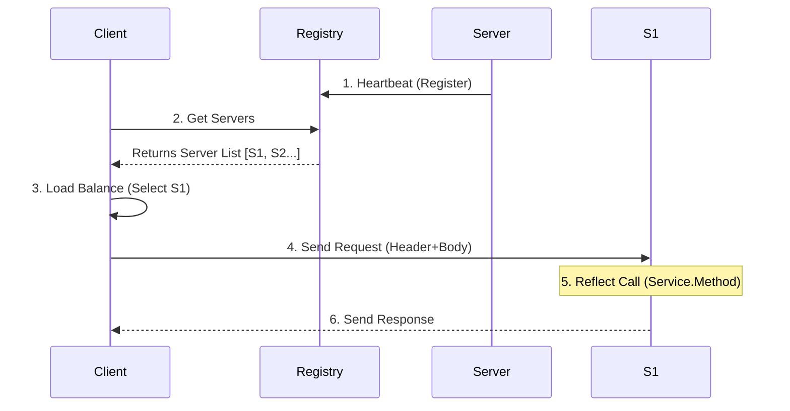

这是一个基于 Go 语言标准库 `net/rpc` 设计思路实现的轻量级 RPC 框架（参考了 Geektutu 的 7days-golang）。它实现了从基本的 **序列化/反序列化**、**服务注册/反射调用**，到高级的 **超时控制**、**负载均衡** 和 **服务发现**。

以下是 gee-rpc 的详细实现原理拆解：

### 1. 核心架构设计
整个框架分为五大核心模块：
1.  **Codec (编解码层)**: 负责将请求/响应数据序列化为二进制流。
2.  **Server (服务端)**: 负责注册服务、监听连接、反射调用业务逻辑。
3.  **Client (客户端)**: 负责建立连接、发送请求、接收响应。
4.  **XClient (支持负载均衡的客户端)**: 在 Client 之上封装，支持服务发现和负载均衡。
5.  **Registry (注册中心)**: 简单的服务注册与心跳保活机制。

---

### 2. 协议与编解码 (Codec)
**文件**: codec/codec.go

RPC 的核心是解决“怎么传”的问题。gee-rpc 定义了一个通用的 `Codec` 接口，支持多种序列化方式（默认实现了 **Gob**，预留了 JSON）。

*   **消息结构**:
    消息被分为 **Header** 和 **Body** 两部分。
    *   **Header**: 包含 `ServiceMethod` (服务名.方法名)、`Seq` (请求序号)、`Error` (错误信息)。
    *   **Body**: 实际的请求参数或响应结果（interface{}）。

*   **接口定义**:
    ```go
    type Codec interface {
        io.Closer
        ReadHeader(*Header) error
        ReadBody(interface{}) error
        Write(*Header, interface{}) error
    }
    ```

---

### 3. 服务端实现 (Server)

服务端主要解决“怎么查”和“怎么调”的问题。

#### 3.1 服务注册与反射 (Service & Method)
**文件**: service.go

为了能动态调用任意对象的方法，框架大量使用了 `reflect` 包。

*   **`methodType`**: 封装了单个方法的信息。
    *   `ArgType`, `ReplyType`: 参数和返回值的反射类型（用于 `newArgv`、`newReplyv` 动态创建实例）。
    *   `NumCalls`: 统计调用次数。
*   **`service`**: 封装了一个服务对象。
    *   `registerMethods()`: 扫描结构体的所有导出方法，过滤出符合 RPC 签名规范的方法：
        `func (t *T) MethodName(argType T1, replyType *T2) error`
    *   `call()`: 最终利用 `reflect.Value.Call()` 执行方法。

#### 3.2 请求处理流程
**文件**: server.go

1.  **协商协议 (`ServeConn`)**:
    连接建立后，首先读取 `Option` JSON 配置，校验 Magic Number，确定编解码方式（如 Gob）。
2.  **并发处理 (`serveCodec`)**:
    *   **Read**: 循环读取请求。注意：这里必须按顺序读取 Header 和 Body。
    *   **Handle**: 读取到一个完整的 Request 后，开启一个 **Goroutine** (`go server.handleRequest`) 去执行业务逻辑。
    *   **Reply**: 执行完后，通过 `sendResponse` 加锁写入响应。注意：**写操作是互斥的** (`sending` 锁)，防止多个 Goroutine 同时向同一个 Socket 写数据导致由于报文交错而乱码。

---

### 4. 客户端实现 (Client)
**文件**: client.go

客户端需要解决“怎么发”和“怎么收”的异步问题。

*   **`Call` 结构体**: 代表一次 RPC 调用，包含 `Done` channel，用于异步通知结果。
*   **双协程模型**:
    1.  **发送**: `Go` -> `send`。将请求参数序列化并发送给服务端，同时将 `Call` 存入 `pending` map (Key 为 Seq)。
    2.  **接收**: `receive` 方法是一个死循环协程。
        *   不断从连接中读取 Header。
        *   根据 Header 中的 `Seq` 从 `pending` map 中找到对应的 `Call`。
        *   读取 Body 到 `Call.Reply`。
        *   调用 `call.done()` 通知调用方。

*   **HTTP 协议兼容 (`NewHTTPClient`)**:
    支持通过 HTTP `CONNECT` 方法建立 TCP 隧道，复用 HTTP 端口。服务端实现了 `ServeHTTP`，拦截 `CONNECT` 请求并劫持连接 (`Hijack`) 转为 RPC 协议。

---

### 5. 高级特性

#### 5.1 超时控制 (Timeout)
实现了两层超时控制：
1.  **连接超时 (`ConnectTimeout`)**: `net.DialTimeout`。
2.  **调用超时 (`HandleTimeout`)**:
    *   **客户端**: 使用 `context.WithTimeout` + `select` 监听 `ctx.Done()` 和 `call.Done`。
    *   **服务端**: 在 `handleRequest` 中使用 `time.After` 和 `select`。如果业务逻辑处理超时，先返回超时错误给客户端（注意：服务端的业务逻辑 Goroutine 仍在后台运行，无法强制 Kill，但客户端不用等了）。

#### 5.2 负载均衡 (XClient)
**文件**: xclient/

`XClient` 是一个支持服务发现的客户端包装器。
*   **Discovery 接口**: 定义了 `Get(mode)` 获取服务地址、`GetAll()` 获取所有地址。
    *   `MultiServersDiscovery`: 手动硬编码服务列表。
    *   `GeeRegistryDiscovery`: 从注册中心动态拉取。
*   **负载均衡策略**:
    *   `RandomSelect`: 随机选择。
    *   `RoundRobinSelect`: 轮询选择。
*   **Broadcast**: 并发调用所有服务实例，只要有一个报错则返回错误，或者全部成功。

#### 5.3 注册中心 (Registry)
**文件**: registry/registry.go

实现了一个简易的 HTTP 注册中心。
*   **心跳机制**: 服务端启动时向 Registry 发送 `POST` 请求（心跳），并定期（Ticker）发送。
*   **保活策略**: Registry 记录每个服务的 `start` 时间。查询 `aliveServers` 时，如果当前时间超过 `start + timeout`，则认为服务挂掉，将其剔除。
*   **服务发现**: 客户端通过 HTTP `GET` 请求 Registry，获取 `X-Geerpc-Servers` Header 中的服务列表。

---

### 总结图示



这个实现麻雀虽小五脏俱全，涵盖了 RPC 框架最核心的**协议设计、反射调用、网络传输、服务发现**四大基石。


在 gee-rpc 中，连接池的实现非常精简，它实际上是一个 **"Client Cache"（客户端缓存）**，而非传统意义上拥有 Min/Max Idle 连接数的复杂连接池。

它的核心逻辑位于 `xclient/xclient.go` 中，目的是 **复用** 与下游服务的长连接，避免每次 RPC 调用都重新建立 TCP 连接。

---

## 生产级 RPC Connection Pool 设计要点（高效 & 健壮）

gee-rpc 的实现更偏“连接复用缓存”。如果你要在生产环境里设计一个更完整的连接池（适用于 HTTP/1.1、Thrift、Redis/MySQL 这类“一请求一连接 / 弱多路复用”的协议），通常需要补齐下面这些能力。

### 1. 核心架构与 Get/Put 流程

连接池本质是一个带容量约束的复用容器（生产者-消费者的变体）。

- **容器（存放 Idle 连接）**
  - 常见实现：队列/链表/切片 + 索引，或者 `chan net.Conn`。
  - 策略建议：**LIFO（后进先出）优先**，更容易复用“刚用过”的连接（TCP 拥塞窗口更热），更老的连接更容易触发 `IdleTimeout` 被淘汰。
- **并发控制**
  - 保护池状态：`sync.Mutex`。
  - 控制等待：`sync.Cond` 或 `chan`。

**Get（借连接）典型逻辑**
1. 尝试从 Idle 容器取出一个连接。
2. 若没有 Idle：
   - `Active < MaxActive`：Dial 新连接。
   - `Active >= MaxActive`：
     - `Wait=true`：阻塞等待归还（建议支持 `context` 取消/超时）。
     - `Wait=false`：直接返回“池耗尽”错误。

**Put（还连接）典型逻辑**
1. 连接损坏/不可复用（EOF、超时、协议错误）：直接 Close，`Active--`。
2. Idle 已满（`Idle >= MaxIdle`）：直接 Close，`Active--`。
3. 否则：放回 Idle 容器等待复用。

### 2. 关键参数（建议必须暴露配置）

- **MaxIdle**：最大空闲连接数（池中最多保留多少个 Idle）。
- **MaxActive**：最大总连接数（Idle + InUse），保护下游与本机 FD。
- **IdleTimeout**：空闲多久回收。
  - 建议：小于服务端的 idle/keepalive 超时（常见经验：对端超时的一半），避免借到“半死”连接。
- **MaxLifetime**：连接最大存活时间（到点强制淘汰）。
  - 价值：避免 NAT/LB/防火墙导致的隐性断连，也利于连接“换血”。

### 3. 健壮性设计（避坑指南）

#### 3.1 健康检查（避免借到已断开的连接）

- **Ping on Borrow**：Get() 时做一次轻量探测。
  - 优点：最安全。
  - 缺点：每次调用增加 RTT。
- **Background KeepAlive**：后台 goroutine 定期探测 Idle 连接。
  - 优点：不影响 Get 延迟。
  - 缺点：探测间隙仍可能断开。

常见折中：仅对“Idle 太久”的连接做 borrow-check，或结合 TCP keepalive + `IdleTimeout`。

#### 3.2 优雅关闭（Graceful Shutdown）

关闭连接池时：
- 设置 `closed`：停止分发新连接。
- 允许 InUse 连接归还。
- 等待 `inUse==0` 或到达 shutdown deadline，再统一销毁。

#### 3.3 连接风暴与预热（WarmUp）

在服务重启/抖动恢复时，大量并发请求可能导致瞬间 Dial 很多连接形成 **Connection Storm**。

建议：
- **MinIdle 预热**：启动时先建立一批连接。
- **限速 Dial**：对建连做 rate-limit，避免打爆 FD/端口。

### 4. Go 实现建议（`chan` / `sync.Cond`）

- **`chan net.Conn` 作为 Idle 队列**：实现简单，天然阻塞队列，容量即 `MaxIdle`。
- **`sync.Cond` + 自定义容器**：更灵活（LIFO、deadline 淘汰、批量回收、等待可控）。

### 5. gRPC / HTTP2 的“连接池”思路

gRPC 基于 HTTP/2 多路复用：
- 通常**不需要传统连接池**：一个 `grpc.ClientConn` 上可并发跑大量 stream。
- 超高并发/带宽场景下，池化的目标更多是**分流**：
  - 维护 N 个 `grpc.ClientConn`，调用时 round-robin 选择一个，避免单连接窗口/带宽成为瓶颈。

### 6. 具体实现与数据结构（Go 骨架）

下面给出一个偏“生产可落地”的连接池骨架（核心关注：LIFO、MaxIdle/MaxActive、IdleTimeout/MaxLifetime、Wait+context、健康检查、优雅关闭）。你可以按协议（Thrift/自定义 RPC）把 `factory`/`check`/`close` 等钩子接进去。

#### 6.1 核心数据结构

设计思路：
- Idle 容器用 `[]*pooledConn`（**LIFO**）
- `active` 记录总连接数（Idle + InUse）
- `cond` 用于池耗尽时等待归还（如果你希望更易写 `select`，可以改用 `chan` 方案）

```go
type pooledConn struct {
    c        net.Conn
    created  time.Time
    lastUsed time.Time
}

type PoolConfig struct {
    MaxIdle     int
    MaxActive   int
    IdleTimeout time.Duration
    MaxLifetime time.Duration
    Wait        bool
}

type ConnPool struct {
    mu     sync.Mutex
    cond   *sync.Cond
    cfg    PoolConfig
    idle   []*pooledConn // LIFO: append/pop
    active int
    closed bool

    // factory: 创建新连接（Dial）。建议内部支持 ctx 超时/取消。
    factory func(ctx context.Context) (net.Conn, error)
    // check: 借出前健康检查（可选）。例如写/读探测或应用层 ping。
    check func(ctx context.Context, c net.Conn) error
}

func NewConnPool(cfg PoolConfig, factory func(context.Context) (net.Conn, error), check func(context.Context, net.Conn) error) *ConnPool {
    p := &ConnPool{cfg: cfg, factory: factory, check: check}
    p.cond = sync.NewCond(&p.mu)
    return p
}
```

#### 6.2 过期判断

```go
func (p *ConnPool) expiredLocked(pc *pooledConn, now time.Time) bool {
    if p.cfg.IdleTimeout > 0 && pc.lastUsed.Add(p.cfg.IdleTimeout).Before(now) {
        return true
    }
    if p.cfg.MaxLifetime > 0 && pc.created.Add(p.cfg.MaxLifetime).Before(now) {
        return true
    }
    return false
}
```

#### 6.3 Get：借连接（简化版）

关键点：
- 优先从 Idle LIFO 取
- 丢弃超时/超龄连接
- 没有 idle 时：
  - `active < MaxActive` Dial 新连接
  - 否则根据 `Wait` 决定阻塞/报错

```go
var (
    ErrPoolClosed    = errors.New("conn pool closed")
    ErrPoolExhausted = errors.New("conn pool exhausted")
)

func (p *ConnPool) Get(ctx context.Context) (net.Conn, error) {
    for {
        p.mu.Lock()
        if p.closed {
            p.mu.Unlock()
            return nil, ErrPoolClosed
        }

        // 1) try idle
        now := time.Now()
        for len(p.idle) > 0 {
            n := len(p.idle)
            pc := p.idle[n-1]
            p.idle[n-1] = nil
            p.idle = p.idle[:n-1]

            if p.expiredLocked(pc, now) {
                p.active--
                p.mu.Unlock()
                _ = pc.c.Close()
                p.mu.Lock()
                continue
            }
            pc.lastUsed = now
            c := pc.c
            p.mu.Unlock()

            if p.check != nil {
                if err := p.check(ctx, c); err != nil {
                    _ = c.Close()
                    p.mu.Lock()
                    p.active--
                    p.mu.Unlock()
                    continue
                }
            }
            return c, nil
        }

        // 2) dial new
        if p.cfg.MaxActive <= 0 || p.active < p.cfg.MaxActive {
            p.active++
            p.mu.Unlock()
            c, err := p.factory(ctx)
            if err != nil {
                p.mu.Lock()
                p.active--
                p.cond.Signal()
                p.mu.Unlock()
                return nil, err
            }
            return c, nil
        }

        // 3) exhausted
        if !p.cfg.Wait {
            p.mu.Unlock()
            return nil, ErrPoolExhausted
        }
        // cond.Wait 不支持 select；生产中可改成 channel 等待，或自己封装可取消等待。
        p.cond.Wait()
        p.mu.Unlock()
    }
}
```

#### 6.4 Put：归还连接（带 MaxIdle/坏连接丢弃）

```go
func (p *ConnPool) Put(c net.Conn, bad bool) {
    if c == nil {
        return
    }
    p.mu.Lock()
    defer func() {
        p.cond.Signal()
        p.mu.Unlock()
    }()

    if p.closed || bad {
        p.active--
        _ = c.Close()
        return
    }
    if p.cfg.MaxIdle > 0 && len(p.idle) >= p.cfg.MaxIdle {
        p.active--
        _ = c.Close()
        return
    }

    now := time.Now()
    p.idle = append(p.idle, &pooledConn{c: c, created: now, lastUsed: now})
}
```

#### 6.5 Close：关闭池（可扩展为优雅关闭）

```go
func (p *ConnPool) Close() {
    p.mu.Lock()
    if p.closed {
        p.mu.Unlock()
        return
    }
    p.closed = true
    idle := p.idle
    p.idle = nil
    p.active -= len(idle)
    p.cond.Broadcast()
    p.mu.Unlock()

    for _, pc := range idle {
        if pc != nil {
            _ = pc.c.Close()
        }
    }
}
```

如果要做到“优雅关闭”：增加 `inUse` 计数（借出 `inUse++`、归还 `inUse--`），Close 时等待 `inUse==0`（带 deadline），再关闭底层连接。

